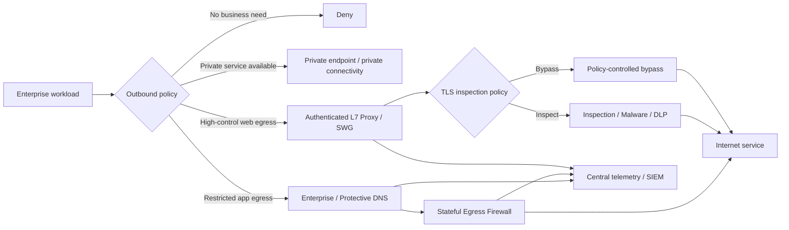

# Enterprise Outbound Network Security

**Status:** Working draft  
**Version:** 0.1  
**Last updated:** 2026-09-11

## 1. Purpose

This document defines security requirements, architectural patterns, risks and trade-offs for outbound network access from enterprise-managed systems to Internet-hosted resources.

The goal is not to force every workload through the same control. The goal is to ensure that every outbound connection is **intentional, attributable, appropriately restricted, observable and resilient**.

The scope includes:

- Enterprise user endpoints.
- Servers and virtual machines.
- Containers and Kubernetes workloads.
- Cloud workloads and serverless services.
- Batch jobs, agents and management tools.
- Application-to-Internet and system-to-system traffic.
- HTTP/HTTPS and non-HTTP protocols.
- SaaS, software update, package repository and external API access.

This document focuses on outbound connectivity. It does not assume that an internal workload is trustworthy merely because it is on an enterprise network.

---

## 2. Executive recommendation

A mature enterprise should use a **tiered outbound model**, not a universal proxy or universal direct-access model.

### Recommended default position

| Workload / destination | Preferred control pattern |
|---|---|
| Sensitive service with supported private connectivity | Private endpoint / private peering / service endpoint, no Internet path where practical |
| User web browsing | Authenticated Secure Web Gateway (SWG) / Layer-7 proxy, malware and content controls, selective TLS inspection where appropriate |
| Enterprise application calling known external APIs | Destination allowlist + enterprise DNS + stateful egress firewall; add Layer-7 proxy when application identity, URL policy or data controls justify it |
| Application requiring strong data-loss controls | Layer-7 proxy/SWG or application-aware egress gateway, subject to protocol compatibility |
| Vendor/SaaS that explicitly recommends direct connectivity or does not tolerate interception | Controlled direct egress with enterprise DNS, network firewall, fixed egress IP where useful, endpoint controls, logging and explicit exception |
| Software/package repositories | Prefer managed enterprise repositories/mirrors; otherwise allowlisted egress with DNS and firewall controls; proxy where compatible |
| Non-HTTP protocols | Protocol-aware gateway where available; otherwise restrictive Layer-3/4 firewall policy and destination allowlisting |
| Unknown/unclassified Internet access from a server workload | Deny by default |

### Policy position

**Unrestricted direct Internet access from enterprise workloads should not be the default.**

At minimum, outbound application traffic should normally pass through:

1. Enterprise-controlled DNS or an approved protective DNS service; and
2. A stateful egress control point that can enforce destination/protocol policy and generate logs.

An authenticated Layer-7 proxy provides stronger control and attribution, but it is not automatically the correct solution for every enterprise application. It introduces application compatibility, certificate, performance, availability and operational dependencies that must be justified by risk.

---

## 3. Threat model

Outbound security must address more than users visiting malicious websites. Enterprise applications and infrastructure can become an outbound channel after compromise.

Key threats include:

| Threat | Example consequence |
|---|---|
| Malware command and control | Compromised server reaches attacker-controlled infrastructure |
| Data exfiltration | Sensitive data sent over HTTPS, DNS, cloud storage or external APIs |
| Supply-chain compromise | Build agent downloads a malicious dependency or update |
| SSRF / application abuse | Vulnerable application is used to access attacker-selected Internet destinations |
| Credential theft and token replay | Compromised workload uses stored credentials to access external services |
| DNS-based attacks | Malware resolves malicious domains or tunnels data using DNS |
| Direct-IP bypass | Workload avoids DNS controls by connecting directly to an IP address |
| Unapproved SaaS / shadow IT | Workload sends enterprise data to unsanctioned services |
| Uncontrolled software updates | Systems retrieve binaries from unverified Internet sources |
| Cryptomining / resource abuse | Compromised compute reaches mining pools or botnet infrastructure |
| Policy evasion | Application uses alternate DNS, DoH/DoT, QUIC or custom protocols to bypass expected controls |
| Insider misuse | Authorized user or administrator deliberately sends information externally |
| Third-party compromise | Approved destination becomes malicious or compromised |
| Egress infrastructure compromise | Proxy/DNS/firewall becomes a high-value control-plane or interception target |

The design therefore needs **prevention, attribution, detection and containment**, rather than relying on a single network control.

---

## 4. Security principles

### 4.1 Deny by default for workloads

Server, cloud and application workloads should have no general Internet access unless there is a documented business need.

Access should be granted to the minimum required:

- Destination or service.
- Protocol.
- Port.
- Direction.
- Environment.
- Workload identity or source.
- Duration, where temporary access is appropriate.

### 4.2 Use identity where it adds value

Network location alone is a weak identity signal.

For user web access, authenticated proxy/SWG controls can provide strong attribution to a person and device.

For machine-to-machine traffic, prefer **workload identity** or a trusted mapping of workload-to-egress policy rather than embedding human-style proxy credentials into applications.

Possible mechanisms include:

- mTLS from workload to an egress gateway.
- Service identities.
- Cloud workload identity.
- Kubernetes service account / namespace identity integrated with policy enforcement.
- Agent-based identity on managed hosts.
- Source network identity only where stronger identity is unavailable and segmentation makes it reliable.

### 4.3 Control DNS centrally

Enterprise workloads should use approved enterprise DNS resolvers or an approved protective DNS service.

Unauthorized outbound DNS should be blocked, including direct external DNS and unapproved encrypted DNS where technically feasible.

DNS should be treated as both:

- A security policy enforcement point; and
- A high-value telemetry source.

### 4.4 Do not rely on DNS filtering alone

Protective DNS can block known malicious domains and provide useful telemetry, but it does not inspect application payloads and can be bypassed in several ways, including direct-IP connections or alternate resolution mechanisms if these are not controlled.

DNS filtering should therefore normally be combined with firewall, endpoint and/or Layer-7 controls.

### 4.5 Prefer explicit destination policy

For application workloads, an allowlist is usually safer than broad category-based Internet access.

Examples:

- `api.vendor.example` over TCP/443.
- Vendor-published endpoint group.
- Approved package repository.
- Approved cloud service endpoint set.

Avoid relying on IP allowlists where the service uses large shared CDN address ranges unless the vendor explicitly supports that model.

### 4.6 Inspection should be risk-based

More inspection is not always better.

TLS interception can expose content to security controls, but it also:

- Creates a decryption point for sensitive traffic.
- Requires enterprise trust/certificate lifecycle management.
- Can break certificate pinning, mTLS and some modern application protocols.
- Can negatively affect supportability and performance.
- Creates privacy and legal considerations.

TLS inspection should therefore be selective and policy-driven rather than automatically applied to every destination.

### 4.7 Security infrastructure must be highly available

DNS, egress firewalls, proxies and SWGs become production dependencies.

The architecture must avoid turning security controls into a single enterprise-wide failure domain.

---

## 5. Baseline enterprise security requirements

The following requirements can form the basis of an enterprise standard.

### OUT-01 — Business justification

Every persistent Internet egress requirement from a server/application workload **must have a documented business owner and technical owner**.

The request should include:

- Source workload/application.
- Environment: production, development, test, DR.
- Destination service/domain.
- Required protocols/ports.
- Expected traffic direction and volume.
- Authentication method to the external service.
- Data classification expected to transit the connection.
- Availability requirement.
- Whether a proxy is supported.
- Whether TLS interception is supported.
- Whether mTLS or certificate pinning is used.

### OUT-02 — Default deny

Workload network zones **should deny general Internet egress by default**.

Broad `any/any` outbound rules should be prohibited except for tightly controlled temporary troubleshooting with approval and logging.

### OUT-03 — Approved DNS

Enterprise workloads **must use approved enterprise DNS/protective DNS resolvers** unless an exception is approved.

The enterprise should block unauthorized DNS paths where practical, including:

- TCP/UDP 53 to arbitrary external resolvers.
- TCP 853 to unauthorized DNS-over-TLS resolvers.
- Known unauthorized DNS-over-HTTPS services where policy requires enterprise resolution.

Encrypted DNS may be used to the enterprise resolver where supported.

### OUT-04 — Protective DNS

Approved resolvers should provide protective capabilities appropriate to the environment, such as:

- Malicious-domain blocking.
- Threat intelligence integration.
- Newly observed/suspicious domain detection where available.
- Sinkholing or policy response where appropriate.
- Query logging.
- DNSSEC validation.
- High availability.

### OUT-05 — Egress enforcement point

Internet-bound traffic from enterprise workloads should traverse an approved egress enforcement point such as:

- Network firewall.
- Cloud-native firewall.
- Secure Web Gateway.
- Explicit proxy.
- Egress gateway.

Direct routing that bypasses all enterprise enforcement should require explicit exception approval.

### OUT-06 — Destination restriction

For application workloads, Internet access should be restricted to approved external services where feasible.

Controls may use:

- FQDN/domain allowlists.
- URL/path rules at Layer 7.
- Vendor-maintained endpoint groups.
- IP ranges where stable and authoritative.
- Service tags or cloud provider managed prefix lists.

### OUT-07 — Identity and attribution

Outbound events must be attributable to the most useful identity available.

For users this should normally include user and device identity.

For applications this should include workload, application, service account, namespace, host, subscription/account/project, or other stable machine identity.

### OUT-08 — Authentication to egress proxy

Where an explicit proxy/SWG is used, anonymous use should not be the default.

However, machine workloads should not be forced to use brittle human-style proxy authentication if a better workload identity mechanism is available.

Credentials used for proxy authentication must be managed as secrets and rotated.

### OUT-09 — TLS policy

Outbound TLS should enforce enterprise minimum cryptographic standards where technically possible.

TLS inspection policy must define:

- Which categories are inspected.
- Which categories are never inspected.
- Certificate-pinned applications.
- mTLS applications.
- Financial, health, authentication and other sensitive categories as relevant to enterprise policy.
- Break-glass bypass process.
- Certificate authority governance and rotation.

### OUT-10 — No blind dependency on TLS inspection

A security design must not assume every HTTPS session can be decrypted.

Where TLS interception is not possible or appropriate, compensating controls should include combinations of:

- Protective DNS.
- Destination allowlisting.
- Endpoint detection and response.
- Application logging.
- CASB/API integration where applicable.
- Vendor-native audit logs.
- Data controls at the application layer.

### OUT-11 — Malware and content controls

Where web content or files are downloaded through an SWG/proxy, the enterprise should consider:

- Malware scanning.
- Reputation filtering.
- File type restrictions.
- Sandbox/detonation for higher-risk content.
- Content disarm/reconstruction for specific use cases.

This is more important for user browsing and general-purpose download systems than for narrowly allowlisted API integrations.

### OUT-12 — Data loss controls

Where regulated or highly sensitive data may leave the enterprise, the architecture should support appropriate controls such as:

- DLP at proxy/SWG.
- API-aware controls.
- Endpoint DLP.
- SaaS-native DLP/CASB.
- Application-level allowlists and schema validation.
- Encryption and key-management requirements.

### OUT-13 — Logging

The enterprise should centrally log, as applicable:

- DNS queries and policy decisions.
- Firewall allow/deny events.
- Proxy/SWG request logs.
- User/workload identity.
- Source workload/environment.
- Destination hostname/IP.
- URL category or policy rule.
- Bytes transferred.
- TLS inspection outcome/bypass reason.
- Malware/DLP verdicts.

Logs should be sent to central monitoring/SIEM with retention based on legal, operational and threat-detection needs.

### OUT-14 — Time synchronization

DNS, firewall, proxy, endpoint and cloud logs must use reliable time synchronization to support cross-system investigation.

### OUT-15 — High availability and fail behaviour

For each enforcement layer, the design must define:

- High-availability architecture.
- Capacity and burst requirements.
- Site/region failure behaviour.
- Dependency on WAN or cloud control planes.
- Fail-open versus fail-closed behaviour.
- Emergency bypass process.

Production applications should not depend on a single proxy appliance, resolver, region or tunnel.

### OUT-16 — Change management

External services change endpoints over time.

Where vendors publish dynamic endpoint lists, the enterprise should automate updates where safe and supported.

Rules should have:

- Owner.
- Reason.
- Creation date.
- Last review date.
- Expiry or recertification date.

### OUT-17 — IPv6 parity

IPv6 outbound traffic must not become a control bypass.

Equivalent DNS, routing, firewall, proxy and monitoring policy should exist for IPv4 and IPv6 where IPv6 is enabled.

### OUT-18 — Modern protocol governance

The enterprise must account for protocols that can alter traditional inspection assumptions, including:

- QUIC / HTTP/3.
- WebSockets.
- Encrypted DNS.
- Long-lived API streams.
- Certificate pinning.
- mTLS.

Protocols should be permitted based on business need and control compatibility, not simply blocked because they are new.

### OUT-19 — Software and dependency retrieval

Critical build and production systems should prefer enterprise-controlled package repositories, artifact repositories or update mirrors rather than unrestricted Internet dependency retrieval.

### OUT-20 — Exception governance

Any requirement to bypass protective DNS, proxy, inspection or normal egress policy should document:

- Technical reason.
- Business owner.
- Security owner/approver.
- Compensating controls.
- Scope.
- Expiry/review date.
- Monitoring requirements.

---

## 6. Security approaches and trade-offs

## 6.1 Approach A — Unrestricted direct Internet access

```text
Application  ----------------------------->  Internet
                little/no egress control
```

### Advantages

- Lowest network complexity.
- Lowest latency in many cases.
- Broadest application compatibility.
- No explicit proxy configuration.
- No TLS interception problems.

### Risks

- Compromised workloads can contact arbitrary command-and-control infrastructure.
- Weak attribution and visibility.
- Easy data exfiltration.
- No central domain or URL policy.
- Difficult to demonstrate least privilege.
- SSRF vulnerabilities can become unrestricted Internet pivots.
- Harder incident containment.

### Operational assessment

**Not recommended as an enterprise default.**

It may be acceptable only for tightly isolated/ephemeral environments with strong compensating controls, or as a formally approved exception.

---

## 6.2 Approach B — Direct egress through Layer-3/4 firewall/NAT

```text
Application -> Stateful Firewall/NAT -> Internet
```

### Controls provided

- Source/destination IP policy.
- Port/protocol restrictions.
- Stateful connection tracking.
- Threat signatures on some next-generation firewalls.
- Stable public egress IPs.
- Flow logging.

### Advantages

- Works with almost all TCP/UDP applications.
- Lower complexity than explicit Layer-7 proxying.
- Minimal application configuration.
- Useful for vendor IP allowlisting of enterprise source addresses.
- Can be cloud-native and highly scalable.

### Risks / limitations

- IP-based allowlists are difficult for SaaS/CDN services with rapidly changing/shared addresses.
- Limited user/workload identity unless integrated with identity context.
- HTTPS content is opaque without TLS inspection.
- Does not inherently stop direct-IP access to allowed address ranges.
- Does not provide URL-path policy.

### Best fit

- Non-HTTP protocols.
- Application integrations with stable destination endpoints.
- Vendor services incompatible with proxying.
- Baseline control underneath more advanced layers.

---

## 6.3 Approach C — Protective DNS + Layer-3/4 firewall

```text
                 +-> Protective / Enterprise DNS
                 |
Application -----+
                 |
                 +-> Egress Firewall/NAT -> Internet
```

### Controls provided

- Malicious-domain blocking.
- DNS telemetry.
- Domain reputation.
- Potential domain allow/deny policy.
- Network port/protocol restrictions at the firewall.

### Advantages

- Good security-to-complexity ratio.
- Usually transparent to applications.
- Can block a significant class of malware/phishing/C2 destinations before connection.
- Works even where explicit HTTP proxying is unsupported.
- DNS logs are highly useful for detection and investigation.

### Risks / limitations

- DNS policy is not equivalent to a Layer-7 proxy.
- Direct-IP connections can bypass name-based policy.
- Applications using unauthorized DoH/DoT can bypass enterprise DNS unless blocked/controlled.
- A permitted domain may host multiple applications/content types.
- A legitimate domain can itself become compromised.
- DNS does not inspect HTTP method, URL path, headers, uploaded data or downloaded content.

### Best fit

This should be considered a **baseline enterprise control** for most workloads, but not the only control for higher-risk use cases.

---

## 6.4 Approach D — Explicit Layer-7 proxy / Secure Web Gateway

```text
Application -> Authenticated L7 Proxy / SWG -> Internet
```

The proxy terminates or intermediates HTTP/HTTPS sessions and makes policy decisions at the application layer.

### Controls provided

Depending on product and configuration:

- User/workload authentication.
- FQDN and URL filtering.
- HTTP method control.
- Reputation/category policy.
- Malware scanning.
- DLP.
- CASB integration.
- Detailed request logging.
- TLS inspection.

### Advantages

- Stronger attribution.
- More precise web policy than IP/firewall controls.
- Can control URLs and content rather than only addresses.
- Better for user browsing and high-risk web traffic.
- Can enforce consistent policy across sites and cloud environments.

### Risks / complexity

#### Application compatibility

Applications may:

- Ignore operating-system proxy settings.
- Require custom proxy environment variables.
- Use non-HTTP protocols.
- Use QUIC or protocol extensions not supported by the proxy.
- Use certificate pinning.
- Use mTLS to the external server.
- Fail when proxy authentication is introduced.

#### Identity complexity

Interactive user authentication is straightforward compared with workload authentication.

For machine workloads, credentials embedded in configuration create lifecycle and secret-management overhead.

#### Availability

The proxy becomes a critical production dependency. A regional proxy failure can affect many otherwise unrelated applications.

#### Performance

Proxy authentication, reputation checks, TLS interception, malware scanning and DLP can add latency and consume capacity.

#### Operations

A proxy allowlist can become a high-change policy database requiring continual updates as SaaS endpoints change.

### Best fit

- User Internet browsing.
- General-purpose web access.
- High-risk applications requiring granular HTTP control.
- Environments where enterprise policy requires content/DLP inspection.

### Not automatically best fit

- High-volume cloud APIs.
- Latency-sensitive SaaS.
- mTLS integrations.
- Certificate-pinned clients.
- Non-HTTP protocols.
- Services whose vendor explicitly recommends bypassing intermediary inspection.

---

## 6.5 Approach E — TLS interception / HTTPS inspection

TLS inspection is a capability layered onto an SWG, proxy or next-generation firewall.

### Security value

It can expose encrypted HTTP content to:

- Malware inspection.
- DLP.
- URL/path policy.
- Threat detection.
- Content controls.

### Risks

- The inspection platform becomes a trusted decryption point for sensitive traffic.
- Enterprise CA/private-key governance becomes security critical.
- Certificate pinning can break.
- mTLS can break or require bypass.
- Some SaaS vendors advise against decryption/intermediation for performance or supportability reasons.
- Certificate rotation and trust distribution create operational dependencies.
- Privacy/legal requirements can constrain what may be inspected.

### Recommended position

Use **selective TLS inspection** based on risk and compatibility.

Maintain explicit categories such as:

1. Inspect.
2. Do not inspect for privacy/legal reasons.
3. Do not inspect for technical compatibility.
4. Temporary bypass pending investigation.

A bypass should not automatically mean uncontrolled access; DNS, firewall, endpoint and destination controls should remain in place.

---

## 6.6 Approach F — Cloud-native egress firewall / distributed egress

Each cloud region/account/VPC/VNet uses cloud-native firewalling or an egress gateway rather than backhauling all traffic to a central datacenter.

### Advantages

- Lower latency.
- Avoids unnecessary backhaul cost.
- Aligns with cloud failure domains.
- Can use cloud-native service tags and managed endpoint objects.
- Scales close to workloads.

### Risks / complexity

- Policy can become fragmented across clouds/accounts/regions.
- Logging and rule governance must be centralized.
- Multiple enforcement technologies may behave differently.
- Security teams need automation and policy-as-code to avoid configuration drift.

### Recommended position

Centralize **policy and telemetry**, not necessarily every packet.

---

## 6.7 Approach G — Centralized enterprise egress hub

```text
Workloads -> WAN / Transit -> Central Egress Hub -> Internet
```

### Advantages

- Consistent inspection stack.
- Centralized operations.
- Easier policy standardization.
- Fewer Internet egress points.

### Risks / complexity

- Creates a large blast radius.
- WAN/transit failure can become an Internet outage for applications.
- Adds latency and data-transfer cost.
- Capacity must handle aggregated enterprise traffic.
- Cross-region/cross-site dependencies can undermine application resilience.

### Recommended position

Use centralized egress where it materially improves control, but avoid unnecessary packet backhaul solely for organizational convenience.

For cloud and SaaS-heavy enterprises, a hybrid design is often stronger: distributed enforcement with centralized governance.

---

## 6.8 Approach H — Private endpoints / private connectivity

```text
Application -> Private Endpoint / Private Peering -> Provider Service
```

Examples include cloud private service endpoints, private peering and dedicated network connections.

### Advantages

- Removes or reduces public Internet exposure.
- Strong destination certainty.
- Can reduce need for Internet proxy policy.
- Often integrates with private DNS and cloud identity controls.

### Risks / complexity

- Higher architecture and routing complexity.
- Private DNS complexity.
- Provider-specific designs.
- Additional cost.
- Does not eliminate application-layer authorization requirements.
- Can create transitive routing assumptions or overlapping private network dependencies.

### Best fit

- Strategic/high-value SaaS/PaaS/cloud services.
- Sensitive data flows.
- High-volume stable integrations.

---

## 7. Direct vs DNS firewall vs authenticated Layer-7 proxy

The question should be answered using the required control outcome.

| Requirement | Direct + firewall | Protective DNS + firewall | Authenticated L7 proxy/SWG |
|---|---:|---:|---:|
| Broad protocol compatibility | **High** | **High** | Medium/Low |
| Low application configuration overhead | **High** | **High** | Medium/Low |
| Malicious-domain blocking | Low/Medium | **High** | **High** |
| User identity | Low | Low/Medium | **High** |
| Workload identity | Medium with integration | Medium with integration | High if properly designed |
| URL/path filtering | No | No | **Yes** |
| File/content scanning | No | No | **Yes** |
| DLP at network egress | No | No | **Yes** |
| Works with mTLS/pinning | **High** | **High** | Variable |
| Works with non-HTTP traffic | **High** | **High** | Low unless product supports protocol |
| Lowest latency | **Best** | Near-best | Variable |
| Operational complexity | Low | Low/Medium | **High** |
| Policy precision | Low/Medium | Medium | **High** |
| Failure-domain impact | Lower | DNS dependent | Potentially high without resilient design |

### Practical answer

For most enterprise **server/application** traffic:

> **Protective DNS + a restrictive stateful egress firewall should be the baseline. Add an authenticated/application-aware Layer-7 proxy when there is a specific security requirement that justifies the extra complexity.**

For most **end-user web browsing**:

> **An identity-aware SWG/proxy is generally appropriate because user attribution, URL/content controls and malware/DLP controls are more valuable and browsers are designed to work with web intermediaries.**

For **approved SaaS/cloud services that are high-volume or interception-sensitive**:

> **Controlled direct egress may be safer and more reliable than forcing traffic through an intermediary, provided enterprise DNS, destination policy, telemetry and endpoint controls remain in place.**

---

## 8. Suggested security tiers

A tier model makes the standard easier to apply.

### Tier 0 — No Internet access

Use for:

- Databases.
- Internal-only systems.
- Highly sensitive back-end services.

Controls:

- Default deny.
- Private enterprise services only.

### Tier 1 — Restricted Internet egress

Use for most server/application workloads.

Controls:

- Enterprise/protective DNS.
- Stateful firewall.
- Explicit destination allowlist.
- Central logging.
- Endpoint/workload protection.

### Tier 2 — Application-aware egress

Use when granular web policy is required.

Controls:

- Everything in Tier 1.
- L7 proxy/SWG/egress gateway.
- Workload identity where practical.
- URL policy.
- Malware scanning where relevant.
- Selective TLS inspection.

### Tier 3 — Sensitive-data egress

Use where sensitive or regulated data can leave the enterprise.

Controls:

- Tier 2 or private connectivity.
- Strong identity.
- DLP/API data policy.
- Enhanced logging.
- Explicit data-owner approval.
- Frequent rule recertification.

### Exception tier — Controlled direct access

Use when:

- Vendor does not support proxy/interception.
- mTLS/pinning prevents interception.
- Performance/latency requirements justify bypass.

Compensating controls:

- Protective DNS.
- Firewall destination allowlist.
- Fixed/known egress identity where useful.
- Endpoint detection.
- Vendor-native logging.
- Documented exception and review date.

---

## 9. Reference architecture



### Architectural principle

The enterprise should build a **control chain**, not depend on one product:

```text
Workload identity
      +
Endpoint/workload security
      +
Enterprise DNS / Protective DNS
      +
Egress firewall
      +
Optional Layer-7 proxy/SWG
      +
Selective TLS inspection / DLP
      +
Central telemetry and detection
```

---

## 10. Application onboarding decision process

For each outbound requirement, ask in this order:

1. **Can the requirement be eliminated?**
   - Can data or software be mirrored internally?
   - Can a managed enterprise service perform the function?

2. **Can private connectivity be used?**
   - Private endpoint.
   - Private peering.
   - Service endpoint.

3. **What destination is actually required?**
   - Exact FQDN/API.
   - Vendor endpoint set.
   - Avoid broad `*.vendor.com` rules unless necessary.

4. **What protocol is required?**
   - HTTPS.
   - WebSocket.
   - SFTP.
   - SMTP.
   - Custom TCP/UDP.
   - QUIC/HTTP3.

5. **Does the application support an explicit proxy?**

6. **Does it support proxy authentication?**

7. **Does the external connection use mTLS or certificate pinning?**

8. **Is TLS/content inspection actually required?**
   - Malware risk?
   - DLP requirement?
   - General web browsing?
   - Or is it a narrow API with strong app-layer authentication?

9. **What data leaves the enterprise?**

10. **What happens if the egress control is unavailable?**
    - Fail closed?
    - Business outage?
    - Alternate region/site?

11. **What telemetry is required?**

12. **Who owns and recertifies the rule?**

---

## 11. Example decisions

### Example 1 — Payroll server calls a known SaaS API

**Preferred:** Enterprise DNS + destination allowlist + stateful firewall. Add L7 proxy only if DLP/content inspection or stronger workload attribution is required and the SaaS supports it.

Why:

- Destination is narrow and predictable.
- Application protocol is known.
- Full general-purpose proxying may add failure modes without proportional security value.

### Example 2 — Developer workstation browses the Internet

**Preferred:** Identity-aware SWG/proxy with protective DNS and endpoint controls.

Why:

- Destination set is intentionally broad.
- User attribution matters.
- Malware/phishing/content controls are valuable.

### Example 3 — Build system downloads packages

**Preferred:** Internal artifact/package repository that synchronizes approved sources. Restrict direct Internet access from build workers.

Fallback:

- Protective DNS.
- Egress firewall.
- Repository/domain allowlist.
- Integrity/signature verification.
- Detailed audit logs.

### Example 4 — Vendor agent uses certificate pinning

**Preferred:** Controlled proxy/TLS-inspection bypass, not a global inspection exemption.

Retain:

- Protective DNS.
- Destination allowlist.
- Firewall logging.
- EDR.
- Vendor endpoint monitoring.

### Example 5 — Application uses mTLS to a partner

An intercepting proxy may be incompatible because it changes TLS termination.

Preferred options:

- Transparent/non-decrypting firewall path with strict destination control; or
- A deliberately designed application gateway pattern where the enterprise terminates and re-establishes mTLS and both parties agree to that trust model.

Do not silently insert generic TLS interception into an mTLS integration.

---

## 12. Risks introduced by stronger centralized controls

Security controls introduce their own risks and must be engineered accordingly.

### Proxy/SWG concentration risk

A compromise or outage can affect a large proportion of enterprise traffic.

Mitigations:

- Multi-zone/region design.
- Capacity testing.
- Independent management plane controls.
- Strong administrative MFA/PAM.
- Config backup/version control.
- Emergency bypass procedures with audit.

### DNS concentration risk

If all enterprise clients depend on central resolvers, resolver failure can appear as a widespread network outage.

Mitigations:

- Multiple resolvers.
- Diverse failure domains.
- Anycast or regional architecture where appropriate.
- Tested failover.
- Monitoring of resolution latency and failure rates.

### TLS interception risk

The inspection CA is effectively trusted to impersonate external TLS services to enterprise clients.

Mitigations:

- HSM/key protection where appropriate.
- Restricted CA purpose.
- Strong administrative controls.
- Short and managed certificate lifecycles where practical.
- Audit.
- Separate policy for sensitive categories.

### Policy-change risk

A mistaken deny rule can cause an application outage; a mistaken allow rule can create a broad exfiltration path.

Mitigations:

- Policy-as-code.
- Peer review.
- Test/staging.
- Change windows for high-risk rules.
- Canary deployments where supported.
- Rule expiry/recertification.

---

## 13. Centralized vs distributed enterprise egress

A common enterprise design question is whether every site/cloud should backhaul Internet traffic to a small number of central egress hubs.

### Centralized egress benefits

- Consistent policy.
- Fewer security stacks.
- Easier operations.
- Simplified logging.

### Centralized egress drawbacks

- Larger outage blast radius.
- Cross-site dependency.
- Backhaul latency.
- WAN dependency.
- Cloud data-transfer costs.
- Difficult scaling for high-volume SaaS.

### Distributed egress benefits

- Local resilience.
- Lower latency.
- Better alignment with cloud regions.
- Reduced backhaul.

### Distributed egress drawbacks

- More enforcement points.
- Risk of policy inconsistency.
- Greater automation requirement.

### Recommended enterprise pattern

**Centralized governance + distributed enforcement** is usually the better long-term target:

- One policy model.
- Common security requirements.
- Automated deployment.
- Regional/local egress enforcement.
- Central logging and analytics.

This avoids making every application dependent on one physical network path while maintaining enterprise control.

---

## 14. Monitoring and detection use cases

The outbound platform should support detections for:

- Newly registered/suspicious domains.
- DNS tunneling indicators.
- Repeated blocked DNS requests.
- Workload contacting a destination outside its normal profile.
- Sudden increase in outbound bytes.
- New destination country/ASN where relevant.
- Direct IP connections from workloads expected to use FQDN policy.
- Attempts to use unauthorized DNS resolvers.
- Attempts to bypass proxy settings.
- TLS inspection failures/bypasses.
- Rare user-agent or protocol behavior.
- Connections to threat-intelligence indicators.
- Workload making Internet connections when it previously made none.

Not all detections belong in the network layer. Correlate network evidence with EDR, cloud, identity and application telemetry.

---

## 15. Governance model

Recommended roles:

| Role | Responsibility |
|---|---|
| Application owner | Business need and application impact |
| Platform/network team | Connectivity implementation and reliability |
| Security architecture | Pattern selection and control requirements |
| Security operations | Monitoring and detection |
| Data owner | Approval when sensitive data leaves enterprise |
| Vendor management | Validates provider endpoints/support statements |
| Change management | Production rule governance |

Rules should be reviewed periodically and removed when the application or integration is retired.

---

## 16. Metrics

Useful enterprise metrics include:

- Percentage of server workloads with unrestricted Internet access.
- Percentage of egress rules with an owner and expiry/review date.
- Percentage of workloads using enterprise/protective DNS.
- Unauthorized DNS attempts blocked.
- Proxy/TLS-inspection bypass count by reason.
- Egress rule count by application.
- Rules using `any` destination.
- Stale rules with no traffic.
- Blocked malicious-domain events.
- DNS/proxy/firewall availability and latency.
- TLS inspection failure rate.
- Number of applications dependent on a single egress region/site.

A useful maturity objective is to drive **unrestricted server egress toward zero** while avoiding controls that unnecessarily reduce application reliability.

---

## 17. Recommended rollout

### Phase 1 — Visibility

- Inventory Internet egress points.
- Enable DNS/firewall flow logging.
- Discover workloads with unrestricted access.
- Identify externally accessed domains/services.

### Phase 2 — DNS control

- Standardize enterprise/protective DNS.
- Block unauthorized external DNS paths.
- Centralize DNS telemetry.

### Phase 3 — Workload egress policy

- Default-deny new server/application zones.
- Establish request/approval process.
- Create destination allowlists.
- Start rule ownership and recertification.

### Phase 4 — Layer-7 controls

- Apply authenticated SWG/proxy to user browsing.
- Identify workload use cases that genuinely require Layer-7 controls.
- Avoid forcing incompatible applications through proxy merely for architectural consistency.

### Phase 5 — Data and identity controls

- Integrate workload identity.
- Introduce DLP/CASB/API controls for sensitive flows.
- Expand private connectivity for strategic services.

### Phase 6 — Automation

- Policy-as-code.
- Automated vendor endpoint updates.
- Automated expiry/recertification.
- Continuous detection of bypass paths.

---

## 18. Key enterprise decisions still to define

Future revisions should establish organization-specific answers for:

1. Is authenticated SWG mandatory for **users only**, or also for selected server workloads?
2. What workload identity mechanism should be standard for proxies/egress gateways?
3. Which categories are subject to TLS inspection?
4. Which categories must never be TLS-inspected?
5. Is general server Internet access prohibited by policy?
6. What is the approved protective DNS platform?
7. How are cloud accounts/VPCs/VNets prevented from creating unmanaged local Internet gateways?
8. What is the standard direct-egress exception process?
9. How are dynamic SaaS endpoint lists automatically maintained?
10. What are the required HA and DR patterns for DNS/proxy/firewall controls?
11. Should production egress use local regional enforcement or centralized hubs?
12. What log retention and SIEM use cases are mandatory?
13. How will IPv6 egress parity be verified?
14. How should QUIC/HTTP3 be governed?
15. What controls apply to package managers, container registries and CI/CD runners?

---

## 19. Standards and guidance references

The recommendations in this draft align with the following sources and principles:

- **NIST SP 800-207 — Zero Trust Architecture**: removes implicit trust based on network location and emphasizes explicit authentication/authorization and resource-centric security.  
  https://csrc.nist.gov/pubs/sp/800/207/final

- **NIST SP 1800-35 — Implementing a Zero Trust Architecture**: practical enterprise zero-trust implementation guidance including identity, segmentation and SASE-related patterns.  
  https://csrc.nist.gov/pubs/sp/1800/35/final

- **NIST SP 800-81 Rev. 3 — Secure Domain Name System (DNS) Deployment Guide**: treats DNS as an enterprise security enforcement and telemetry component and provides guidance for secure recursive DNS, encrypted DNS and DNSSEC.  
  https://csrc.nist.gov/pubs/sp/800/81/r3/final

- **NSA — Adopting Encrypted DNS in Enterprise Environments**: recommends directing enterprise DNS, encrypted or otherwise, to designated enterprise resolvers and blocking unauthorized resolver paths.  
  https://www.nsa.gov/Press-Room/News-Highlights/Article/Article/2471956/nsa-recommends-how-enterprises-can-securely-adopt-encrypted-dns/

- **CISA Protective DNS guidance**: describes protective DNS as a means of blocking malicious destinations and improving detection/response using DNS telemetry and threat intelligence.  
  https://www.cisa.gov/sites/default/files/2025-05/Approved%20CSSO-Protective%20DNS%20FAQ%202024.pdf

- **Microsoft 365 network connectivity guidance**: demonstrates an important trade-off in enterprise proxy design; Microsoft recommends bypassing certain high-volume/latency-sensitive Microsoft 365 traffic from proxy authentication and TLS break-and-inspect, showing why enterprise architecture should support controlled direct paths rather than assuming all SaaS should be intercepted.  
  https://learn.microsoft.com/en-us/microsoft-365/enterprise/network-intermediation

- **Microsoft TLS inspection guidance**: documents certificate pinning and mTLS as cases that can require TLS-inspection bypass and emphasizes monitoring inspection failures.  
  https://learn.microsoft.com/en-us/entra/global-secure-access/faq-transport-layer-security

---

## 20. Draft position statement

> Enterprise outbound connectivity is a security boundary and must be governed explicitly. Server and application workloads should not receive unrestricted Internet access by default. Enterprise/protective DNS and stateful egress enforcement form the baseline control layer. Layer-7 proxying, authentication, TLS inspection, malware scanning and DLP should be added where the additional visibility and policy precision justify their compatibility, performance, resilience and operational costs. Private connectivity should be preferred for sensitive strategic services where practical. Direct Internet access is an exception pattern—not necessarily insecure when tightly controlled, but it must remain attributable, restricted, observable and reviewed.
