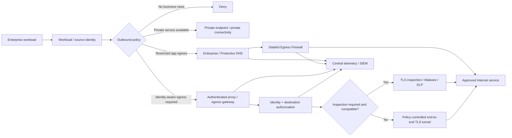

# Enterprise Outbound Network Security

**Status:** Working draft  
**Version:** 0.2  
**Last updated:** 2026-09-16

## 1. Purpose

This document defines security requirements, architectural patterns, risks and trade-offs for outbound network access from enterprise-managed systems to Internet-hosted resources.

The goal is not to force every workload through the same control. The goal is to ensure that every outbound connection is **intentional, attributable, authorized, appropriately restricted, observable and resilient**.

The scope includes:

- Enterprise user endpoints.
- Servers and virtual machines.
- Containers and Kubernetes workloads.
- Cloud workloads and serverless services.
- Batch jobs, agents and management tools.
- Application-to-Internet and system-to-system traffic.
- HTTP/HTTPS and non-HTTP protocols.
- SaaS, software update, package repository and external API access.

This document focuses on outbound connectivity. It does not assume that an internal workload is trustworthy merely because it is on an enterprise network.

---

## 2. Executive recommendation

A mature enterprise should use a **tiered outbound model**, not a universal proxy or universal direct-access model.

The core security objective is broader than simply deploying a proxy. The enterprise should maintain the integrity of the complete outbound path so that a compromised workload cannot select an easier, uncontrolled route to the Internet.

### Recommended default position

| Workload / destination | Preferred control pattern |
|---|---|
| Internal-only or crown-jewel service with no Internet requirement | No Internet route; private enterprise services only |
| Sensitive service with supported private connectivity | Private endpoint / private peering / service endpoint; no Internet path where practical |
| User web browsing | Identity-aware Secure Web Gateway (SWG) / Layer-7 proxy, malware and content controls, selective TLS inspection where appropriate |
| Enterprise application calling known external APIs | Destination allowlist + enterprise DNS + stateful egress firewall; add identity-aware Layer-7 proxy or egress gateway when attribution, URL policy or data controls justify it |
| Application requiring strong data-loss controls | Layer-7 proxy/SWG or application-aware egress gateway, subject to protocol compatibility |
| Vendor/SaaS that explicitly recommends direct connectivity or does not tolerate interception | Controlled direct egress with enterprise DNS, restrictive firewall policy, fixed egress IP where useful, endpoint controls, logging and explicit exception |
| Software/package repositories | Prefer managed enterprise repositories/mirrors; otherwise allowlisted egress with DNS and firewall controls; proxy where compatible |
| Non-HTTP or long-lived protocols | Protocol-aware gateway where available; otherwise restrictive Layer-3/4 firewall policy and destination allowlisting |
| Privileged management infrastructure | No general Internet access; explicit destination-specific egress only |
| Unknown/unclassified Internet access from a server workload | Deny by default |

### Policy position

**Unrestricted direct Internet access from enterprise workloads should not be the default.**

At minimum, outbound application traffic should normally pass through:

1. Enterprise-controlled DNS or an approved protective DNS service; and
2. An approved stateful egress enforcement point that can enforce destination/protocol policy and generate logs.

For medium- and high-risk workloads, the enterprise should additionally use stronger workload attribution and authorization where practical.

An authenticated Layer-7 proxy can provide stronger control and attribution, but proxy authentication is **not itself the security objective**. The required outcome is that the connection is attributable, authorized to the minimum destination/service required, observable, and unable to bypass the intended enforcement path.

Authentication, authorization, inspection and routing enforcement are separate controls:

- **Authentication / attribution:** Who or what is making the connection?
- **Authorization:** Where and by which protocol is that identity allowed to connect?
- **Inspection:** What can the control point observe or inspect about the traffic?
- **Path enforcement:** Can the workload bypass the intended control by taking another route?

A strong enterprise design addresses all four as appropriate to the workload.

---

## 3. Threat model and breach-driven rationale

Outbound security must address more than users visiting malicious websites. Enterprise applications and infrastructure can become an outbound channel after compromise.

Key threats include:

| Threat | Example consequence |
|---|---|
| Malware command and control | Compromised server reaches attacker-controlled infrastructure |
| Ransomware staging and exfiltration | Threat actor copies data to external storage, file-transfer service or attacker infrastructure before encryption/extortion |
| Data exfiltration | Sensitive data sent over HTTPS, DNS, cloud storage, tunnels or external APIs |
| Supply-chain compromise | Build agent downloads a malicious dependency or update |
| SSRF / application abuse | Vulnerable application is used to access attacker-selected Internet destinations |
| Credential theft and token replay | Compromised workload uses stored credentials to access external services |
| DNS-based attacks | Malware resolves malicious domains or tunnels data using DNS |
| Direct-IP bypass | Workload avoids DNS controls by connecting directly to an IP address |
| Unapproved SaaS / shadow IT | Workload sends enterprise data to unsanctioned services |
| Uncontrolled software updates | Systems retrieve binaries from unverified Internet sources |
| Cryptomining / resource abuse | Compromised compute reaches mining pools or botnet infrastructure |
| Policy evasion | Application uses alternate DNS, DoH/DoT, QUIC, tunnels or custom protocols to bypass expected controls |
| Insider misuse | Authorized user or administrator deliberately sends information externally |
| Third-party compromise | Approved destination becomes malicious or compromised |
| Egress infrastructure compromise | Proxy/DNS/firewall becomes a high-value control-plane or interception target |

Recent CISA advisories continue to demonstrate why outbound controls matter after initial compromise. Ransomware and intrusion actors have used common file-transfer tools, cloud storage, HTTP/S tunnels and other outbound mechanisms for command-and-control or exfiltration. CISA guidance also recommends restricting server Internet access and, for sensitive management networks, blocking egress except to explicitly authorized destinations.

This does **not** mean an outbound proxy will stop every ransomware incident. A permitted destination can be abused, credentials can be stolen, and data can leave through legitimate applications. The security value is defense in depth:

- Reduce the number of destinations a compromised workload can reach.
- Remove simple direct-to-Internet C2 and exfiltration paths.
- Increase the attacker's need to abuse an already-approved service or control.
- Generate attributable telemetry for detection and incident response.
- Support rapid containment by changing policy centrally.

The design therefore needs **prevention, attribution, authorization, detection and containment**, rather than relying on a single network control.

---

## 4. Security principles

### 4.1 Deny by default for workloads

Server, cloud and application workloads should have no general Internet access unless there is a documented business need.

Access should be granted to the minimum required:

- Destination or service.
- Protocol.
- Port.
- Direction.
- Environment.
- Workload identity or reliable source context.
- Duration, where temporary access is appropriate.

### 4.2 Preserve egress-path integrity

A controlled egress design is weakened if a workload has another route that can bypass the intended enforcement point.

When an application is required to use an egress firewall, gateway or proxy, architecture and testing should consider possible alternate paths, including:

- Direct Internet/NAT gateways.
- Secondary interfaces or routes.
- IPv6 where only IPv4 controls were implemented.
- Alternate explicit proxies.
- Direct-IP connections that bypass DNS-based controls.
- Unauthorized DNS, DoH or DoT.
- QUIC/HTTP3 or other transports that bypass an expected TCP/TLS inspection path.
- Cloud-created Internet gateways, public IPs or unmanaged routing.
- Tunnels established over otherwise permitted protocols.

A proxy should not become an optional security path while broad direct Internet access remains available beside it.

### 4.3 Use identity where it adds value

Network location alone is a weak identity signal.

For user web access, authenticated proxy/SWG controls can provide strong attribution to a person and device.

For machine-to-machine traffic, prefer **workload identity** or a trusted mapping of workload-to-egress policy rather than embedding human-style proxy credentials into applications.

Possible mechanisms include:

- mTLS from workload to an egress gateway.
- Service identity / service-mesh identity.
- Cloud workload identity.
- Kubernetes service account / namespace identity integrated with policy enforcement.
- Agent-based identity on managed hosts.
- Source network identity only where stronger identity is unavailable and segmentation makes it reliable.

Authentication should be paired with authorization. A workload that authenticates successfully should not automatically receive unrestricted Internet access.

### 4.4 Separate authentication, authorization and inspection

An authenticated egress connection may still carry end-to-end encrypted traffic that the proxy cannot inspect. Conversely, a transparent firewall may strongly restrict a workload to one destination without authenticating it at Layer 7.

The architecture should explicitly state which control provides:

- Workload/user authentication.
- Destination and protocol authorization.
- Content or application-layer inspection.
- Logging and attribution.
- Bypass prevention.

This prevents designs from assuming that "proxy" automatically means authenticated, inspected and least-privilege.

### 4.5 Control DNS centrally

Enterprise workloads should use approved enterprise DNS resolvers or an approved protective DNS service.

Unauthorized outbound DNS should be blocked, including direct external DNS and unapproved encrypted DNS where technically feasible.

DNS should be treated as both:

- A security policy enforcement point; and
- A high-value telemetry source.

### 4.6 Do not rely on DNS filtering alone

Protective DNS can block known malicious domains and provide useful telemetry, but it does not inspect application payloads and can be bypassed in several ways, including direct-IP connections or alternate resolution mechanisms if these are not controlled.

DNS filtering should therefore normally be combined with firewall, endpoint and/or Layer-7 controls.

### 4.7 Prefer explicit destination policy

For application workloads, an allowlist is usually safer than broad category-based Internet access.

Examples:

- `api.vendor.example` over TCP/443.
- Vendor-published endpoint group.
- Approved package repository.
- Approved cloud service endpoint set.

Avoid relying on IP allowlists where the service uses large shared CDN address ranges unless the vendor explicitly supports that model.

### 4.8 Inspection should be risk-based

More inspection is not always better.

TLS interception can expose content to security controls, but it also:

- Creates a decryption point for sensitive traffic.
- Requires enterprise trust/certificate lifecycle management.
- Can break certificate pinning, mTLS and some modern application protocols.
- Can negatively affect supportability and performance.
- Creates privacy and legal considerations.

TLS inspection should therefore be selective and policy-driven rather than automatically applied to every destination.

A TLS-inspection bypass must not automatically become an egress-control bypass. Destination policy, DNS controls, workload attribution and logging should remain where technically possible.

### 4.9 Security infrastructure must be highly available

DNS, egress firewalls, proxies and SWGs become production dependencies.

The architecture must avoid turning security controls into a single enterprise-wide failure domain.

### 4.10 Centralize policy and telemetry; distribute enforcement where appropriate

A strong enterprise architecture does not require every packet to cross one central datacenter.

Cloud and site-local enforcement can improve resilience and latency while enterprise-wide policy, logging, exception governance and monitoring remain centralized.

---

## 5. Baseline enterprise security requirements

The following requirements can form the basis of an enterprise standard.

### OUT-01 — Business justification

Every persistent Internet egress requirement from a server/application workload **must have a documented business owner and technical owner**.

The request should include:

- Source workload/application.
- Environment: production, development, test, DR.
- Security profile / criticality.
- Destination service/domain.
- Required protocols/ports.
- Expected traffic direction and volume.
- Authentication method to the external service.
- Data classification expected to transit the connection.
- Availability requirement.
- Whether a proxy/tunnel is supported.
- Whether proxy authentication/workload identity is supported.
- Whether TLS interception is supported.
- Whether mTLS or certificate pinning is used.

### OUT-02 — Default deny

Workload network zones **should deny general Internet egress by default**.

Broad `any/any` outbound rules should be prohibited except for tightly controlled temporary troubleshooting with approval and logging.

### OUT-03 — Approved DNS

Enterprise workloads **must use approved enterprise DNS/protective DNS resolvers** unless an exception is approved.

The enterprise should block unauthorized DNS paths where practical, including:

- TCP/UDP 53 to arbitrary external resolvers.
- TCP 853 to unauthorized DNS-over-TLS resolvers.
- Known unauthorized DNS-over-HTTPS services where policy requires enterprise resolution.

Encrypted DNS may be used to the enterprise resolver where supported.

### OUT-04 — Protective DNS

Approved resolvers should provide protective capabilities appropriate to the environment, such as:

- Malicious-domain blocking.
- Threat intelligence integration.
- Newly observed/suspicious domain detection where available.
- Sinkholing or policy response where appropriate.
- Query logging.
- DNSSEC validation.
- High availability.

### OUT-05 — Egress enforcement point

Internet-bound traffic from enterprise workloads should traverse an approved egress enforcement point such as:

- Network firewall.
- Cloud-native firewall.
- Secure Web Gateway.
- Explicit proxy.
- Egress gateway.
- Application/RPC gateway where protocol-specific authorization is required.

Direct routing that bypasses all enterprise enforcement should require explicit exception approval.

### OUT-06 — Destination restriction

For application workloads, Internet access should be restricted to approved external services where feasible.

Controls may use:

- FQDN/domain allowlists.
- URL/path rules at Layer 7.
- Vendor-maintained endpoint groups.
- IP ranges where stable and authoritative.
- Service tags or cloud provider managed prefix lists.

A permitted source identity should not automatically imply permission to reach arbitrary Internet destinations.

### OUT-07 — Identity and attribution

Outbound events must be attributable to the most useful identity available.

For users this should normally include user and device identity.

For applications this should include workload, application, service account, namespace, host, subscription/account/project, or other stable machine identity.

For high-security environments, source IP/subnet alone should generally not be treated as the strongest available identity if a cryptographically verifiable workload identity is practical.

### OUT-08 — Authentication to egress proxy/gateway

Where an explicit proxy/SWG or identity-aware egress gateway is used, anonymous use should not be the default for workloads requiring attributable egress.

However, machine workloads should not be forced to use brittle human-style proxy authentication if a better workload identity mechanism is available.

Credentials used for proxy authentication must be managed as secrets and rotated.

### OUT-09 — Egress authorization independent of authentication

Successful authentication to a proxy, SWG or egress gateway **must not automatically authorize unrestricted Internet access**.

Where feasible, authorization should bind the workload/user identity to the minimum required:

- Destination/service.
- Protocol/port.
- URL or method where the gateway can enforce it.
- Environment.
- Data or transaction policy where application-aware controls exist.

### OUT-10 — Egress-path integrity

Workloads subject to controlled egress should not have an alternative route capable of bypassing the intended policy.

Architecture and validation should account for:

- IPv4 and IPv6.
- Direct NAT/Internet gateways.
- Public IP assignment.
- Secondary routing paths.
- Unauthorized proxies.
- Direct-IP traffic.
- Unauthorized DNS and encrypted DNS.
- QUIC/HTTP3 and other alternate transports where relevant.
- Tunnels over otherwise permitted traffic.

### OUT-11 — TLS policy

Outbound TLS should enforce enterprise minimum cryptographic standards where technically possible.

TLS inspection policy must define:

- Which categories are inspected.
- Which categories are never inspected.
- Certificate-pinned applications.
- mTLS applications.
- Financial, health, authentication and other sensitive categories as relevant to enterprise policy.
- Break-glass bypass process.
- Certificate authority governance and rotation.

### OUT-12 — No blind dependency on TLS inspection

A security design must not assume every HTTPS session can be decrypted.

Where TLS interception is not possible or appropriate, compensating controls should include combinations of:

- Protective DNS.
- Destination allowlisting.
- Workload identity.
- Non-decrypting CONNECT/tunnel policy where supported.
- Endpoint detection and response.
- Application logging.
- CASB/API integration where applicable.
- Vendor-native audit logs.
- Data controls at the application layer.

### OUT-13 — Malware and content controls

Where web content or files are downloaded through an SWG/proxy, the enterprise should consider:

- Malware scanning.
- Reputation filtering.
- File type restrictions.
- Sandbox/detonation for higher-risk content.
- Content disarm/reconstruction for specific use cases.

This is more important for user browsing and general-purpose download systems than for narrowly allowlisted API integrations.

### OUT-14 — Data loss controls

Where regulated or highly sensitive data may leave the enterprise, the architecture should support appropriate controls such as:

- DLP at proxy/SWG.
- API-aware controls.
- Endpoint DLP.
- SaaS-native DLP/CASB.
- Application-level allowlists and schema validation.
- Transaction/method restrictions where supported.
- Encryption and key-management requirements.

### OUT-15 — Logging

The enterprise should centrally log, as applicable:

- DNS queries and policy decisions.
- Firewall allow/deny events.
- Proxy/SWG/egress-gateway request logs.
- User/workload identity.
- Source workload/environment.
- Destination hostname/IP.
- Destination port/protocol.
- URL category or policy rule where visible.
- Bytes transferred.
- TLS inspection outcome/bypass reason.
- Authentication and authorization decision.
- Malware/DLP verdicts.

Logs should be sent to central monitoring/SIEM with retention based on legal, operational and threat-detection needs.

### OUT-16 — Time synchronization

DNS, firewall, proxy, endpoint and cloud logs must use reliable time synchronization to support cross-system investigation.

### OUT-17 — High availability and fail behaviour

For each enforcement layer, the design must define:

- High-availability architecture.
- Capacity and burst requirements.
- Site/region failure behaviour.
- Dependency on WAN or cloud control planes.
- Fail-open versus fail-closed behaviour.
- Emergency bypass process.

Production applications should not depend on a single proxy appliance, resolver, region or tunnel.

Higher-security environments should prefer fail-closed behavior for security controls unless a documented safety/availability requirement justifies otherwise.

### OUT-18 — Change management

External services change endpoints over time.

Where vendors publish dynamic endpoint lists, the enterprise should automate updates where safe and supported.

Rules should have:

- Owner.
- Reason.
- Creation date.
- Last review date.
- Expiry or recertification date.

### OUT-19 — IPv6 parity

IPv6 outbound traffic must not become a control bypass.

Equivalent DNS, routing, firewall, proxy and monitoring policy should exist for IPv4 and IPv6 where IPv6 is enabled.

### OUT-20 — Modern protocol governance

The enterprise must account for protocols that can alter traditional inspection assumptions, including:

- QUIC / HTTP/3.
- WebSockets.
- gRPC / HTTP/2.
- Encrypted DNS.
- Long-lived API streams.
- Certificate pinning.
- mTLS.
- Custom TCP/UDP protocols.

Protocols should be permitted based on business need and control compatibility, not simply blocked because they are new.

### OUT-21 — Software and dependency retrieval

Critical build and production systems should prefer enterprise-controlled package repositories, artifact repositories or update mirrors rather than unrestricted Internet dependency retrieval.

### OUT-22 — Privileged and high-value infrastructure

Management networks, identity infrastructure, security tooling, backup infrastructure, build/signing systems and other crown-jewel systems should normally have **no general Internet egress**.

Where Internet access is required, it should be destination-specific and strongly logged. Higher-risk environments should use stronger workload identity or dedicated gateways where practical.

### OUT-23 — Exception governance

Any requirement to bypass protective DNS, proxy, inspection or normal egress policy should document:

- Technical reason.
- Business owner.
- Security owner/approver.
- Compensating controls.
- Scope.
- Security profile/criticality.
- Expiry/review date.
- Monitoring requirements.

An exception from TLS inspection is not automatically an exception from destination restriction, identity, logging or egress-path enforcement.

### OUT-24 — Bypass detection and validation

The enterprise should continuously or periodically validate that workloads cannot bypass required egress controls.

Validation may include:

- Attempts to reach known test destinations directly.
- Direct-IP tests.
- Unauthorized DNS/DoH/DoT tests.
- IPv6 path validation.
- Cloud configuration checks for public IPs and unmanaged Internet gateways.
- Detection of alternate proxies or tunnels.
- Comparison of expected proxy/firewall telemetry with endpoint or flow telemetry.

---

## 6. Security approaches and trade-offs

### 6.1 Approach A — Unrestricted direct Internet access

```text
Application  ----------------------------->  Internet
                little/no egress control
```

#### Advantages

- Lowest network complexity.
- Lowest latency in many cases.
- Broadest application compatibility.
- No explicit proxy configuration.
- No TLS interception problems.

#### Risks

- Compromised workloads can contact arbitrary command-and-control infrastructure.
- Weak attribution and visibility.
- Easy data exfiltration.
- No central domain or URL policy.
- Difficult to demonstrate least privilege.
- SSRF vulnerabilities can become unrestricted Internet pivots.
- Ransomware operators can more easily use arbitrary file-transfer, tunnelling or cloud-storage destinations.
- Harder incident containment.

#### Operational assessment

**Not recommended as an enterprise default.**

It may be acceptable only for tightly isolated/ephemeral environments with strong compensating controls, or as a formally approved exception.

---

### 6.2 Approach B — Direct egress through Layer-3/4 firewall/NAT

```text
Application -> Stateful Firewall/NAT -> Internet
```

#### Controls provided

- Source/destination IP policy.
- Port/protocol restrictions.
- Stateful connection tracking.
- Threat signatures on some next-generation firewalls.
- Stable public egress IPs.
- Flow logging.

#### Advantages

- Works with almost all TCP/UDP applications.
- Lower complexity than explicit Layer-7 proxying.
- Minimal application configuration.
- Useful for vendor IP allowlisting of enterprise source addresses.
- Can be cloud-native and highly scalable.

#### Risks / limitations

- IP-based allowlists are difficult for SaaS/CDN services with rapidly changing/shared addresses.
- Limited user/workload identity unless integrated with identity context.
- HTTPS content is opaque without TLS inspection.
- Does not inherently stop direct-IP access to broad allowed address ranges.
- Does not provide URL-path or application-method policy.

#### Best fit

- Non-HTTP protocols.
- Application integrations with stable destination endpoints.
- Vendor services incompatible with proxying.
- Baseline control underneath more advanced layers.

---

### 6.3 Approach C — Protective DNS + Layer-3/4 firewall

```text
                 +-> Protective / Enterprise DNS
                 |
Application -----+
                 |
                 +-> Egress Firewall/NAT -> Internet
```

#### Controls provided

- Malicious-domain blocking.
- DNS telemetry.
- Domain reputation.
- Potential domain allow/deny policy.
- Network port/protocol restrictions at the firewall.

#### Advantages

- Good security-to-complexity ratio.
- Usually transparent to applications.
- Can block a significant class of malware/phishing/C2 destinations before connection.
- Works where explicit HTTP proxying is unsupported.
- DNS logs are highly useful for detection and investigation.

#### Risks / limitations

- DNS policy is not equivalent to a Layer-7 proxy.
- Direct-IP connections can bypass name-based policy.
- Applications using unauthorized DoH/DoT can bypass enterprise DNS unless blocked/controlled.
- A permitted domain may host multiple applications/content types.
- A legitimate domain can itself become compromised.
- DNS does not inspect HTTP method, URL path, headers, uploaded data or downloaded content.

#### Best fit

This should be considered a **baseline enterprise control** for most workloads, but not the only control for higher-risk use cases.

---

### 6.4 Approach D — Explicit Layer-7 proxy / Secure Web Gateway

```text
Application -> Authenticated / identity-aware L7 Proxy or SWG -> Internet
```

The proxy makes policy decisions at the application layer. Depending on configuration, it may either tunnel end-to-end TLS or terminate/intercept TLS.

#### Controls provided

Depending on product and configuration:

- User/workload authentication.
- Identity-to-destination authorization.
- FQDN and URL filtering.
- HTTP method control.
- Reputation/category policy.
- Malware scanning.
- DLP.
- CASB integration.
- Detailed request logging.
- TLS inspection.

#### Advantages

- Stronger attribution.
- More precise web policy than IP/firewall controls.
- Can control URLs and content where traffic is inspectable.
- Better for user browsing and high-risk web traffic.
- Can enforce consistent policy across sites and cloud environments.

#### Risks / complexity

Applications may ignore proxy settings, require custom proxy configuration, use unsupported protocols, use QUIC, use certificate pinning, use mTLS or fail when proxy authentication is introduced.

Machine workload credentials create lifecycle and secret-management overhead if human-style usernames/passwords are used instead of workload identity.

The proxy also becomes a production dependency and concentration point. Authentication, reputation checks, TLS interception, malware scanning and DLP can add latency and consume capacity.

#### Important distinction: CONNECT/tunnel vs TLS inspection

An explicit proxy can authenticate a workload and authorize the destination while tunnelling TLS end-to-end. In that pattern the proxy can often log identity, target host/port, session timing and byte counts without seeing the encrypted application payload.

TLS inspection is a separate capability and should only be enabled where required and compatible.

#### Best fit

- User Internet browsing.
- General-purpose web access.
- High-risk applications requiring granular HTTP control.
- Workloads where identity-bound destination policy has material value.
- Environments where enterprise policy requires content/DLP inspection.

#### Not automatically best fit

- High-volume cloud APIs.
- Latency-sensitive SaaS.
- Applications whose client does not support the proxy/tunnelling mechanism.
- Some mTLS or certificate-pinned integrations where intermediary termination is required.
- Non-HTTP protocols unsupported by the gateway.
- Services whose vendor explicitly recommends bypassing intermediary inspection.

---

### 6.5 Approach E — Workload-aware egress gateway / service egress

```text
Workload identity -> Egress Gateway -> Approved external service
```

This pattern is particularly useful in Kubernetes, service-mesh and cloud-native environments.

#### Security value

- Applies policy to application/service identity rather than only source IP.
- Can bind specific workloads to specific external destinations.
- Provides consistent telemetry as workloads move or scale.
- Can provide mTLS between workload and gateway.
- May support protocol/application-specific controls.

#### Risks / complexity

- Requires an identity infrastructure and lifecycle model.
- Gateway availability becomes a workload dependency.
- Identity compromise still requires downstream authorization controls.
- Not every legacy application integrates cleanly with service-mesh or workload-identity patterns.

#### Recommended position

Use for medium/high-risk workloads where stronger attribution materially improves control and the platform can support it cleanly.

---

### 6.6 Approach F — TLS interception / HTTPS inspection

TLS inspection is a capability layered onto an SWG, proxy or next-generation firewall.

#### Security value

It can expose encrypted HTTP content to:

- Malware inspection.
- DLP.
- URL/path policy.
- Threat detection.
- Content controls.

#### Risks

- The inspection platform becomes a trusted decryption point for sensitive traffic.
- Enterprise CA/private-key governance becomes security critical.
- Certificate pinning can break.
- mTLS can break or require deliberate termination/re-origination.
- Some SaaS vendors advise against decryption/intermediation for performance or supportability reasons.
- Certificate rotation and trust distribution create operational dependencies.
- Privacy/legal requirements can constrain what may be inspected.

#### Recommended position

Use **selective TLS inspection** based on risk and compatibility.

Maintain explicit categories such as:

1. Inspect.
2. Do not inspect for privacy/legal reasons.
3. Do not inspect for technical compatibility.
4. Temporary bypass pending investigation.

A bypass should not automatically mean uncontrolled access; DNS, identity, firewall, destination and logging controls should remain where practical.

---

### 6.7 Approach G — Cloud-native egress firewall / distributed egress

Each cloud region/account/VPC/VNet uses cloud-native firewalling or an egress gateway rather than backhauling all traffic to a central datacenter.

#### Advantages

- Lower latency.
- Avoids unnecessary backhaul cost.
- Aligns with cloud failure domains.
- Can use cloud-native service tags and managed endpoint objects.
- Scales close to workloads.

#### Risks / complexity

- Policy can become fragmented across clouds/accounts/regions.
- Logging and rule governance must be centralized.
- Multiple enforcement technologies may behave differently.
- Security teams need automation and policy-as-code to avoid configuration drift.

#### Recommended position

Centralize **policy and telemetry**, not necessarily every packet.

---

### 6.8 Approach H — Centralized enterprise egress hub

```text
Workloads -> WAN / Transit -> Central Egress Hub -> Internet
```

#### Advantages

- Consistent inspection stack.
- Centralized operations.
- Easier policy standardization.
- Fewer Internet egress points.

#### Risks / complexity

- Creates a large blast radius.
- WAN/transit failure can become an Internet outage for applications.
- Adds latency and data-transfer cost.
- Capacity must handle aggregated enterprise traffic.
- Cross-region/cross-site dependencies can undermine application resilience.

#### Recommended position

Use centralized egress where it materially improves control, but avoid unnecessary packet backhaul solely for organizational convenience.

For cloud and SaaS-heavy enterprises, a hybrid design is often stronger: distributed enforcement with centralized governance.

---

### 6.9 Approach I — Private endpoints / private connectivity

```text
Application -> Private Endpoint / Private Peering -> Provider Service
```

Examples include cloud private service endpoints, private peering and dedicated network connections.

#### Advantages

- Removes or reduces public Internet exposure.
- Strong destination certainty.
- Can reduce need for Internet proxy policy.
- Often integrates with private DNS and cloud identity controls.

#### Risks / complexity

- Higher architecture and routing complexity.
- Private DNS complexity.
- Provider-specific designs.
- Additional cost.
- Does not eliminate application-layer authorization requirements.
- Can create transitive routing assumptions or overlapping private network dependencies.

#### Best fit

- Strategic/high-value SaaS/PaaS/cloud services.
- Sensitive data flows.
- High-volume stable integrations.

---

## 7. Direct vs DNS/firewall vs identity-aware proxy/gateway

The question should be answered using the required control outcome.

| Requirement | Direct + restrictive firewall | Protective DNS + firewall | Identity-aware proxy / egress gateway |
|---|---:|---:|---:|
| Broad protocol compatibility | **High** | **High** | Medium/Low depending on product |
| Low application configuration overhead | **High** | **High** | Medium/Low |
| Malicious-domain blocking | Low/Medium | **High** | **High** |
| User identity | Low | Low/Medium | **High** |
| Workload identity | Medium with integration | Medium with integration | **High if properly designed** |
| Identity-bound destination authorization | Limited | Limited/Medium | **High** |
| URL/path filtering | No | No | Yes where traffic is inspectable |
| File/content scanning | No | No | Yes with TLS/content inspection |
| DLP at network egress | No | No | Yes with compatible inspection |
| Works with end-to-end mTLS/pinning | **High** | **High** | Often yes through non-decrypting tunnel; variable if TLS is intercepted |
| Works with arbitrary non-HTTP traffic | **High** | **High** | Product/protocol dependent |
| Lowest latency | **Best** | Near-best | Variable |
| Operational complexity | Low | Low/Medium | **High** |
| Policy precision | Low/Medium | Medium | **High** |
| Failure-domain impact | Lower | DNS dependent | Potentially high without resilient design |

### Practical answer

For most enterprise **server/application** traffic:

> **Protective DNS + a restrictive stateful egress firewall should be the baseline. Add workload identity and an identity-aware Layer-7 proxy/egress gateway where stronger attribution or application-aware policy materially reduces risk.**

For most **end-user web browsing**:

> **An identity-aware SWG/proxy is generally appropriate because user attribution, URL/content controls and malware/DLP controls are more valuable and browsers are designed to work with web intermediaries.**

For **approved SaaS/cloud services that are high-volume or interception-sensitive**:

> **Controlled direct egress may be safer and more reliable than forcing traffic through a TLS-intercepting intermediary, provided enterprise DNS, destination authorization, telemetry, endpoint controls and egress-path integrity remain in place.**

The enterprise should avoid the false choice of "proxy or direct." A non-decrypting authenticated tunnel, workload-aware egress gateway, private endpoint or restrictive L4 path may provide the required security outcome without full TLS interception.

---

## 8. Security profiles: Low, Medium and High

Security profiles make the standard easier to apply while retaining a common baseline.

"Low" does not mean uncontrolled Internet access. It means a lower-impact environment can rely on simpler controls where risk is lower.

| Control | Low / Standard | Medium / Enhanced | High / High Assurance |
|---|---|---|---|
| Default Internet posture | Controlled; no unnecessary broad access | Default deny for application workloads | Default deny; general Internet normally prohibited |
| Enterprise/protective DNS | Required | Required | Required |
| Stateful egress enforcement | Required | Required | Required, often dedicated/segmented |
| Destination allowlisting | Where practical | Normally required for servers/apps | Required; narrowly scoped |
| Workload identity | Helpful | Strongly preferred for higher-risk workloads | Required where technically practical |
| Identity-bound egress policy | Optional/selective | Preferred for broad or sensitive egress | Expected for permitted application egress where supported |
| TLS inspection | Risk-based | Selective | Selective; never assumed universally possible |
| DLP/application-aware controls | As required by data | Required for sensitive flows | Strong controls at network and/or application layer |
| Private connectivity | Optional | Preferred for strategic services | Preferred wherever feasible |
| Fail behavior | Availability-driven | Risk-based | Fail closed preferred for security controls unless explicitly justified |
| Rule review | Periodic | Regular | Frequent / automated recertification |
| Bypass validation | Periodic | Regular | Continuous/automated where practical |
| General Internet from privileged infrastructure | Discouraged | Normally prohibited | Prohibited except explicit service-specific paths |

### Low / Standard environment

Typical examples:

- Low-impact development systems.
- Non-sensitive utility workloads.
- Systems where compromise would have limited enterprise impact.

Minimum posture:

- Enterprise/protective DNS.
- Stateful egress enforcement and logging.
- No unmanaged direct Internet route.
- Reasonable protocol restrictions.
- Destination restrictions where practical.
- EDR/workload protection.

### Medium / Enhanced environment

Typical examples:

- Production business applications.
- Systems processing confidential enterprise information.
- General CI/CD and integration platforms.

Posture:

- Default-deny server/application egress.
- Explicit destination allowlists.
- Enterprise/protective DNS.
- Central telemetry.
- Workload identity where practical.
- Identity-aware proxy/egress gateway where destination sets are broad or attribution materially improves security.
- Selective TLS inspection/DLP where justified.
- Regular bypass validation and rule recertification.

### High / High Assurance environment

Typical examples:

- Identity/security infrastructure.
- Privileged management systems.
- Backup/recovery infrastructure.
- Code-signing or high-value build systems.
- Systems processing highly sensitive or regulated data.
- Crown-jewel production services.

Posture:

- No general Internet route.
- Private connectivity first.
- Explicit service-specific egress only.
- Strong workload identity where technically practical.
- Identity-bound destination authorization.
- Enhanced detection and data controls.
- Short rule lifecycle and frequent recertification.
- Continuous or automated bypass/path-integrity validation.
- Fail closed preferred unless a documented safety/business-continuity requirement dictates otherwise.

### Controlled direct-access exception

Controlled direct access is a transport pattern, not a lower security tier.

Use when:

- Vendor does not support proxy/interception.
- Protocol/client compatibility prevents the preferred gateway path.
- mTLS/pinning prevents TLS interception.
- Performance/latency requirements justify the design.

Compensating controls should include:

- Protective DNS.
- Firewall destination allowlist.
- Fixed/known egress identity where useful.
- Endpoint detection.
- Vendor-native logging.
- No arbitrary alternate Internet path.
- Documented exception and review date.

---

## 9. Reference architecture: defense in depth



### Architectural principle

The enterprise should build a **control chain**, not depend on one product:

```text
Workload / user identity
      +
Endpoint/workload security
      +
Enterprise DNS / Protective DNS
      +
Destination/protocol authorization
      +
Stateful egress enforcement
      +
Optional identity-aware proxy / egress gateway
      +
Optional selective TLS inspection / DLP
      +
Egress-path integrity / bypass prevention
      +
Central telemetry and detection
```

No single layer is sufficient:

- EDR may be disabled or bypassed.
- DNS can be bypassed by direct IP or alternate resolvers.
- A firewall may see only IP/port.
- A proxy may be bypassed if direct Internet routing remains available.
- Authentication does not prevent abuse by an already-compromised identity.
- TLS inspection cannot safely or technically inspect every application.
- Destination allowlisting cannot prevent abuse of a permitted service.

Defense in depth aims to make compromise harder to operationalize and easier to detect and contain.

---

## 10. Application onboarding decision process

For each outbound requirement, ask in this order:

1. **Can the requirement be eliminated?**
   - Can data or software be mirrored internally?
   - Can a managed enterprise service perform the function?

2. **Can private connectivity be used?**
   - Private endpoint.
   - Private peering.
   - Service endpoint.

3. **What security profile applies?**
   - Low / Standard.
   - Medium / Enhanced.
   - High / High Assurance.

4. **What destination is actually required?**
   - Exact FQDN/API.
   - Vendor endpoint set.
   - Avoid broad `*.vendor.com` rules unless necessary.

5. **What protocol is required?**
   - HTTPS.
   - HTTP/2 / gRPC.
   - WebSocket.
   - SFTP.
   - SMTP.
   - Custom TCP/UDP.
   - QUIC/HTTP3.

6. **Can the client use an explicit proxy, tunnel or egress gateway?**

7. **Can the workload authenticate to the egress control using a machine-appropriate identity?**

8. **Can the egress policy bind that identity to specific destinations/services?**

9. **Does the external connection use mTLS or certificate pinning?**

10. **Is TLS/content inspection actually required?**
    - Malware risk?
    - DLP requirement?
    - General web browsing?
    - Or a narrow API with strong app-layer authentication?

11. **What data or transactions can leave the enterprise?**

12. **Can a compromised workload abuse the permitted external service itself?**
    - Does method/API-level authorization belong in an application/API gateway?

13. **Is there any alternative route that can bypass the chosen control?**
    - Direct Internet/NAT?
    - IPv6?
    - Direct IP?
    - DoH/DoT?
    - Alternate proxy/tunnel?

14. **What happens if the egress control is unavailable?**
    - Fail closed?
    - Business outage?
    - Alternate region/site?

15. **What telemetry is required?**

16. **Who owns and recertifies the rule?**

---

## 11. Example decisions

### Example 1 — Payroll server calls a known SaaS API

**Preferred:** Enterprise DNS + destination allowlist + stateful firewall. Add identity-aware egress only if stronger workload attribution, URL/API policy or DLP is required and compatible.

Why:

- Destination is narrow and predictable.
- Application protocol is known.
- General-purpose TLS interception may add failure modes without proportional security value.

### Example 2 — Developer workstation browses the Internet

**Preferred:** Identity-aware SWG/proxy with protective DNS and endpoint controls.

Why:

- Destination set is intentionally broad.
- User attribution matters.
- Malware/phishing/content controls are valuable.

### Example 3 — Build system downloads packages

**Preferred:** Internal artifact/package repository that synchronizes approved sources. Restrict direct Internet access from build workers.

Fallback:

- Protective DNS.
- Egress firewall.
- Repository/domain allowlist.
- Integrity/signature verification.
- Detailed audit logs.

### Example 4 — Vendor agent uses certificate pinning

**Preferred:** Controlled TLS-inspection bypass, not a global egress exemption.

Retain:

- Protective DNS.
- Destination allowlist.
- Firewall/proxy tunnel logging where available.
- EDR.
- Vendor endpoint monitoring.

### Example 5 — Application uses mTLS to a partner

An intercepting proxy may be incompatible because it changes TLS termination. A non-decrypting tunnel may still be possible depending on client and proxy support.

Preferred options:

- Identity-aware non-decrypting proxy/tunnel with strict destination authorization where compatible; or
- Transparent/non-decrypting firewall path with strict destination control; or
- A deliberately designed application gateway pattern where the enterprise terminates and re-establishes mTLS and both parties agree to that trust model.

Do not silently insert generic TLS interception into an mTLS integration.

### Example 6 — Privileged management server needs vendor updates

**Preferred:** No general Internet access. Use an internal update repository or allow only explicitly approved vendor endpoints through a dedicated egress policy.

Why:

- Compromise of management infrastructure has disproportionate blast radius.
- Broad unauthenticated outbound access provides an unnecessary C2/exfiltration route.

---

## 12. Risks introduced by stronger centralized controls

Security controls introduce their own risks and must be engineered accordingly.

### Proxy/SWG concentration risk

A compromise or outage can affect a large proportion of enterprise traffic.

Mitigations:

- Multi-zone/region design.
- Capacity testing.
- Independent management plane controls.
- Strong administrative MFA/PAM.
- Config backup/version control.
- Emergency bypass procedures with audit and expiry.

### DNS concentration risk

If all enterprise clients depend on central resolvers, resolver failure can appear as a widespread network outage.

Mitigations:

- Multiple resolvers.
- Diverse failure domains.
- Anycast or regional architecture where appropriate.
- Tested failover.
- Monitoring of resolution latency and failure rates.

### TLS interception risk

The inspection CA is effectively trusted to impersonate external TLS services to enterprise clients.

Mitigations:

- HSM/key protection where appropriate.
- Restricted CA purpose.
- Strong administrative controls.
- Short and managed certificate lifecycles where practical.
- Audit.
- Separate policy for sensitive categories.

### Identity concentration risk

If workload identity is used for egress, compromise of the issuing system or gateway can affect many applications.

Mitigations:

- Short-lived credentials/certificates where practical.
- Strong issuer protection.
- Scoped identities.
- Destination authorization independent of authentication.
- Revocation/rotation capability.
- Central audit.

### Policy-change risk

A mistaken deny rule can cause an application outage; a mistaken allow rule can create a broad exfiltration path.

Mitigations:

- Policy-as-code.
- Peer review.
- Test/staging.
- Change windows for high-risk rules.
- Canary deployments where supported.
- Rule expiry/recertification.

---

## 13. Centralized vs distributed enterprise egress

A common enterprise design question is whether every site/cloud should backhaul Internet traffic to a small number of central egress hubs.

### Centralized egress benefits

- Consistent policy.
- Fewer security stacks.
- Easier operations.
- Simplified logging.

### Centralized egress drawbacks

- Larger outage blast radius.
- Cross-site dependency.
- Backhaul latency.
- WAN dependency.
- Cloud data-transfer costs.
- Difficult scaling for high-volume SaaS.

### Distributed egress benefits

- Local resilience.
- Lower latency.
- Better alignment with cloud regions.
- Reduced backhaul.

### Distributed egress drawbacks

- More enforcement points.
- Risk of policy inconsistency.
- Greater automation requirement.

### Recommended enterprise pattern

**Centralized governance + distributed enforcement** is usually the better long-term target:

- One policy model.
- Common security requirements.
- Common identity model where practical.
- Automated deployment.
- Regional/local egress enforcement.
- Central logging and analytics.

This avoids making every application dependent on one physical network path while maintaining enterprise control.

---

## 14. Monitoring and detection use cases

The outbound platform should support detections for:

- Newly registered/suspicious domains.
- DNS tunneling indicators.
- Repeated blocked DNS requests.
- Workload contacting a destination outside its normal profile.
- Sudden increase in outbound bytes.
- New destination country/ASN where relevant.
- Direct-IP connections from workloads expected to use FQDN policy.
- Attempts to use unauthorized DNS resolvers.
- Attempts to bypass proxy/gateway settings.
- Unexpected direct Internet connections from proxy-managed workloads.
- TLS inspection failures/bypasses.
- Authentication failures or use of an unexpected workload identity.
- Identity attempting destinations outside its approved profile.
- Rare user-agent or protocol behavior.
- Unexpected file-transfer clients or protocols.
- Use of cloud storage, tunnelling services or remote-management tools outside approved policy.
- Connections to threat-intelligence indicators.
- Workload making Internet connections when it previously made none.
- High-value systems attempting general Internet access.

Not all detections belong in the network layer. Correlate network evidence with EDR, cloud, identity and application telemetry.

A particularly useful correlation is:

```text
Expected workload identity / host
    + expected DNS query
    + expected proxy or firewall event
    + expected destination
    + expected application behavior
```

Missing one of these expected signals may indicate a bypass path or logging gap.

---

## 15. Governance model

Recommended roles:

| Role | Responsibility |
|---|---|
| Application owner | Business need and application impact |
| Platform/network team | Connectivity implementation, egress-path integrity and reliability |
| Security architecture | Pattern selection, profile assignment and control requirements |
| Security operations | Monitoring, detection and bypass hunting |
| Identity/platform team | Workload identity where used |
| Data owner | Approval when sensitive data leaves enterprise |
| Vendor management | Validates provider endpoints/support statements |
| Change management | Production rule governance |

Rules should be reviewed periodically and removed when the application or integration is retired.

---

## 16. Metrics

Useful enterprise metrics include:

- Percentage of server workloads with unrestricted Internet access.
- Percentage of high-security workloads with any general Internet route.
- Percentage of egress rules with an owner and expiry/review date.
- Percentage of workloads using enterprise/protective DNS.
- Percentage of medium/high application egress rules bound to a workload identity where supported.
- Unauthorized DNS attempts blocked.
- Proxy/TLS-inspection bypass count by reason.
- Direct-egress exception count.
- Egress rule count by application.
- Rules using `any` destination.
- Stale rules with no traffic.
- Blocked malicious-domain events.
- Proxy/gateway authorization denies by workload identity.
- Detected attempts to bypass required egress controls.
- DNS/proxy/firewall availability and latency.
- TLS inspection failure rate.
- Number of applications dependent on a single egress region/site.

A useful maturity objective is to drive **unrestricted server egress toward zero** while avoiding controls that unnecessarily reduce application reliability.

---

## 17. Recommended rollout

### Phase 1 — Visibility

- Inventory Internet egress points.
- Enable DNS/firewall flow logging.
- Discover workloads with unrestricted access.
- Identify externally accessed domains/services.
- Identify alternate Internet paths, public IPs and unmanaged cloud gateways.

### Phase 2 — DNS and baseline path control

- Standardize enterprise/protective DNS.
- Block unauthorized external DNS paths.
- Centralize DNS telemetry.
- Ensure outbound traffic crosses an approved enforcement point.

### Phase 3 — Workload egress policy

- Default-deny new server/application zones.
- Establish request/approval process.
- Create destination allowlists.
- Start rule ownership and recertification.
- Prioritize privileged infrastructure and high-value systems.

### Phase 4 — Identity-aware and Layer-7 controls

- Apply authenticated SWG/proxy to user browsing.
- Identify workload use cases where identity-aware egress materially reduces risk.
- Prefer machine/workload identity over embedded human-style credentials.
- Avoid forcing incompatible applications through TLS interception merely for architectural consistency.

### Phase 5 — Data and application controls

- Introduce DLP/CASB/API controls for sensitive flows.
- Add application/method-level authorization where a permitted external service could itself be abused.
- Expand private connectivity for strategic services.

### Phase 6 — Automation and bypass assurance

- Policy-as-code.
- Automated vendor endpoint updates.
- Automated expiry/recertification.
- Continuous detection of bypass paths.
- Cloud policy checks for unmanaged public IPs/Internet gateways.
- Regular IPv4/IPv6/direct-IP/alternate-DNS egress tests.

---

## 18. Key enterprise decisions still to define

Future revisions should establish organization-specific answers for:

1. Is authenticated SWG mandatory for **users only**, or also for selected server workloads?
2. What workload identity mechanism should be standard for proxies/egress gateways?
3. What security profile criteria define Low/Standard, Medium/Enhanced and High/High-Assurance workloads?
4. Which categories are subject to TLS inspection?
5. Which categories must never be TLS-inspected?
6. Is general server Internet access prohibited by policy?
7. Which systems are designated privileged/crown-jewel systems with no general Internet egress?
8. What is the approved protective DNS platform?
9. How are cloud accounts/VPCs/VNets prevented from creating unmanaged local Internet gateways/public IPs?
10. What is the standard direct-egress exception process?
11. How are dynamic SaaS endpoint lists automatically maintained?
12. What are the required HA and DR patterns for DNS/proxy/firewall/egress gateway controls?
13. Should production egress use local regional enforcement or centralized hubs?
14. What log retention and SIEM use cases are mandatory?
15. How will IPv6 egress parity be verified?
16. How should QUIC/HTTP3 be governed?
17. What controls apply to package managers, container registries and CI/CD runners?
18. How will egress-path integrity and bypass testing be continuously validated?

---

## 19. Standards and guidance references

The recommendations in this draft align with the following sources and principles:

- **NIST SP 800-207 — Zero Trust Architecture**: removes implicit trust based on network location and emphasizes explicit authentication/authorization and resource-centric security.  
  https://csrc.nist.gov/pubs/sp/800/207/final

- **NIST SP 800-207A — A Zero Trust Architecture Model for Access Control in Cloud-Native Applications in Multi-Cloud Environments**: extends zero-trust concepts to application/service identities, API gateways, sidecar proxies, service meshes and egress gateways; particularly relevant to workload-aware outbound policy.  
  https://csrc.nist.gov/pubs/sp/800/207/a/final

- **NIST SP 1800-35 — Implementing a Zero Trust Architecture**: practical enterprise zero-trust implementation guidance including identity, segmentation and SASE-related patterns.  
  https://csrc.nist.gov/pubs/sp/1800/35/final

- **NIST SP 800-53 Rev. 5 — Security and Privacy Controls for Information Systems and Organizations**, particularly **SC-7 Boundary Protection**. SC-7(5) describes deny-by-default/allow-by-exception for inbound and outbound network communications. Other SC-7 enhancements address authenticated proxying and controls against unauthorized exfiltration.  
  https://csrc.nist.gov/pubs/sp/800/53/r5/upd1/final

- **NIST SP 800-81 Rev. 3 — Secure Domain Name System (DNS) Deployment Guide**: treats DNS as an enterprise security enforcement and telemetry component and provides guidance for secure recursive DNS, encrypted DNS and DNSSEC.  
  https://csrc.nist.gov/pubs/sp/800/81/r3/final

- **NSA — Adopting Encrypted DNS in Enterprise Environments**: recommends directing enterprise DNS, encrypted or otherwise, to designated enterprise resolvers and blocking unauthorized resolver paths.  
  https://www.nsa.gov/Press-Room/News-Highlights/Article/Article/2471956/nsa-recommends-how-enterprises-can-securely-adopt-encrypted-dns/

- **CISA Protective DNS guidance**: describes protective DNS as a means of blocking malicious destinations and improving detection/response using DNS telemetry and threat intelligence.  
  https://www.cisa.gov/sites/default/files/2025-05/Approved%20CSSO-Protective%20DNS%20FAQ%202024.pdf

- **CISA Zero Trust Maturity Model and microsegmentation guidance**: support increasingly granular, resource/service-specific access and stronger visibility rather than implicit trust based on network location.  
  https://www.cisa.gov/resources-tools/resources/zero-trust-maturity-model  
  https://www.cisa.gov/news-events/alerts/2025/07/29/cisa-releases-part-one-zero-trust-microsegmentation-guidance

- **CISA #StopRansomware Guide and ransomware advisories**: document common exfiltration patterns involving outbound web/file-transfer/cloud mechanisms and reinforce the value of monitoring and restricting unnecessary egress.  
  https://www.cisa.gov/stopransomware/ransomware-guide  
  https://www.cisa.gov/news-events/cybersecurity-advisories/aa23-352a

- **CISA AA25-239A — Countering Chinese State-Sponsored Actors Compromise of Networks Worldwide**: includes explicit guidance to restrict outbound connectivity from sensitive management infrastructure and to block management-VRF egress except to authorized destinations.  
  https://www.cisa.gov/news-events/cybersecurity-advisories/aa25-239a

- **Microsoft 365 network connectivity guidance**: demonstrates an important trade-off in enterprise proxy design; Microsoft recommends bypassing certain high-volume/latency-sensitive Microsoft 365 traffic from proxy authentication and TLS break-and-inspect, showing why enterprise architecture should support controlled direct paths rather than assuming all SaaS should be intercepted.  
  https://learn.microsoft.com/en-us/microsoft-365/enterprise/network-intermediation

- **Microsoft TLS inspection guidance**: documents certificate pinning and mTLS as cases that can require TLS-inspection bypass and emphasizes monitoring inspection failures.  
  https://learn.microsoft.com/en-us/entra/global-secure-access/faq-transport-layer-security

---

## 20. Draft position statement

> Enterprise outbound connectivity is a security boundary and must be governed explicitly. Server and application workloads should not receive unrestricted Internet access by default. Enterprise/protective DNS, destination/protocol authorization and stateful egress enforcement form the baseline control layer. Medium- and high-risk workloads should increasingly use strong workload attribution and identity-bound egress policy where technically practical. Layer-7 proxying, TLS inspection, malware scanning and DLP are separate capabilities and should be added where their security value justifies compatibility, performance, resilience and operational costs. A TLS-inspection bypass must not become an uncontrolled Internet bypass. Private connectivity should be preferred for sensitive strategic services where practical. Direct Internet access is an exception transport pattern—not necessarily insecure when tightly controlled, but it must remain attributable, authorized, restricted, observable, resilient and reviewed.

---

# Appendix A — gRPC, RPC and blockchain connectivity example

This appendix uses blockchain RPC as a concrete example of the general outbound principles. The enterprise standard is **not blockchain-specific**; the same reasoning applies to other gRPC, JSON-RPC and long-lived API integrations.

## A.1 Why this is a useful example

A blockchain application may need to connect to an Internet-hosted RPC provider using:

- HTTPS JSON-RPC.
- gRPC over HTTP/2 and TLS.
- WebSockets/WSS.
- Long-lived streaming connections.
- Provider-specific TCP/TLS protocols.

These protocols demonstrate why the enterprise should distinguish:

1. Authentication to the egress control.
2. Destination authorization.
3. End-to-end TLS.
4. TLS/content inspection.
5. Application/RPC method authorization.

## A.2 gRPC through an authenticated proxy

gRPC over TLS can often traverse an HTTP CONNECT proxy when the client/runtime supports proxy configuration.

Conceptually:

```text
Blockchain application
        |
        | workload identity / proxy authentication
        v
Authenticated HTTP CONNECT Proxy
        |
        | authorize CONNECT rpc.provider.example:443
        v
+---------------------------------------+
| End-to-end TLS + HTTP/2 + gRPC tunnel |
+---------------------------------------+
        |
        v
Blockchain RPC provider
```

This pattern can provide:

- Workload attribution.
- Destination/port authorization.
- Connection timing and byte-count telemetry.
- Central policy enforcement.
- End-to-end TLS between application and provider.

The proxy does **not** necessarily see the gRPC methods or payload when TLS remains end-to-end. This can be desirable where mTLS, certificate pinning, privacy or compatibility prevents decryption.

The enterprise should therefore avoid assuming:

> gRPC or mTLS automatically requires completely uncontrolled direct Internet access.

A non-decrypting CONNECT/tunnel may be possible even when TLS interception is not.

Client/library support must be validated for the specific implementation.

## A.3 JSON-RPC and WebSockets

HTTPS JSON-RPC usually follows the same proxy patterns as other HTTPS API traffic.

Secure WebSockets (`wss://`) can often traverse HTTP CONNECT proxies, but the architecture should validate:

- Proxy support for connection upgrades/tunnelling.
- Long-lived connection limits.
- Idle timeouts.
- Authentication renewal behavior.
- Maximum connection duration and throughput.

A conventional web proxy may not support every custom TCP/UDP RPC protocol. Where it does not, use a restrictive Layer-4 egress path or protocol-aware gateway rather than granting arbitrary Internet access.

## A.4 Defense-in-depth example

A strong design might be:

```text
Application workload
      |
      | workload identity
      v
Internal RPC/API gateway (optional)
      |
      | method / transaction policy
      v
Authenticated egress proxy / gateway
      |
      | destination = rpc.provider.example:443 only
      v
Stateful firewall / approved Internet egress
      |
      v
Blockchain RPC provider
```

Supporting controls:

```text
Enterprise / protective DNS
        +
Endpoint / workload EDR
        +
No alternate direct Internet path
        +
Central proxy/firewall/DNS/application logs
        +
Rate / volume anomaly detection
```

## A.5 Why destination control alone may not be sufficient

Suppose an application is legitimately permitted to reach:

```text
rpc.provider.example:443
```

Destination allowlisting prevents the compromised workload from simply reaching an arbitrary attacker domain, but the attacker may still try to abuse the **approved RPC provider**.

A generic egress proxy may be unable to distinguish operations inside end-to-end TLS.

For higher-risk workloads, use application-aware controls where practical. For example, an internal RPC/API gateway could permit read/query operations while restricting higher-risk administrative or transaction-submission methods.

Conceptually:

```text
Allowed:
- query state
- read block / transaction status
- approved read-only API methods

Restricted / separately authorized:
- submit signed transaction
- administrative/debug methods
- arbitrary contract or privileged methods
```

The exact methods depend on the blockchain/provider and application business requirement.

This general pattern also applies to non-blockchain APIs: destination authorization controls **where** a workload can connect; API authorization controls **what it can do once connected**.

## A.6 Transaction signing and key separation

For applications that submit blockchain transactions, network access should not automatically imply unrestricted access to signing keys.

Higher-security architectures should consider separating:

- Application logic.
- RPC/network access.
- Transaction authorization.
- Signing/HSM/key-management service.

This limits the impact of compromise of any single component.

## A.7 Recommended decision pattern

For gRPC/RPC or blockchain integration:

1. Identify exact provider endpoint(s) and protocol(s).
2. Determine whether private connectivity is available.
3. Test explicit HTTP CONNECT or supported egress-gateway mechanisms.
4. Prefer workload identity over embedded human-style proxy credentials.
5. Bind identity to the specific provider destination/port.
6. Preserve end-to-end TLS where interception is unnecessary or incompatible.
7. Add application/RPC method policy for high-risk operations where required.
8. Prevent alternate direct Internet paths.
9. Correlate DNS, proxy/gateway, firewall and application logs.
10. Treat direct egress as a controlled exception only when the proxy/gateway mechanism is genuinely incompatible.

## A.8 Broader applicability

The same architecture applies to many enterprise protocols and use cases, including:

- Financial market data/API clients.
- SaaS APIs.
- Cloud control-plane APIs.
- Telemetry collectors.
- Long-lived streaming services.
- Partner integrations using mTLS.
- Certificate-pinned vendor agents.
- Machine-to-machine gRPC services.

The lesson is general: **do not equate inability to inspect application payloads with inability to authenticate, authorize, restrict and log the outbound connection.**
